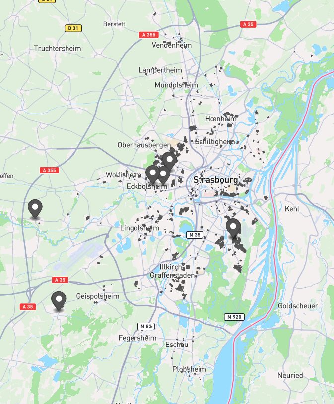

# Cartographie des Logements Sociaux

Ce projet Symfony permet de créer des cartes interactives des logements sociaux en fusionnant des données de parcelles des personnes morales avec la géométrie des parcelles cadastrales.

Il a été développé dans le but de cartografier les logements HLM. Il est cependant possible de l'utiliser pour réconcilier d'autres parcelles cadastrales et personnes morales.

Il a été développé pour réconcilier le jeu de données national des personnes morales et des parcelles cadastrales issu de l'Euro-Métropole de Strasbourg.
Le script peut facilement être adapté à d'autres jeux de données CSV via la configuration des colonnes à réconcilier.



## À quoi sert ce projet ?

Les organismes de logement social disposent de listes d'adresses et de codes parcelles avec leur point GPS, mais sans informations géographiques précises comme le contour des logements. 
Ce projet permet de récupérer les géométries (polygones) des parcelles depuis les données cadastrales puis de générer un fichier GeoJSON exploitable pour la cartographie.

Le résultat est un fichier contenant le point GPS et le polygone précis de chaque logement HLM, permettant de visualiser les logements sociaux sur une carte interactive.

## Note technique

Ce projet n'est pas une application Symfony standard. Il s'agit d'une application console qui utilise les composants Symfony (Console, DependencyInjection, Dotenv).
Le point d'entrée principal est le fichier `bin/console`, qui a été modifié pour initialiser manuellement le conteneur de paramèters, de services et les commandes.
Cette approche "single-file" est légère et adaptée pour un outil en ligne de commande.

## Installation

### Prérequis

- PHP 8.4 ou supérieur
- Composer

### Installation des dépendances

```bash
composer install
```

## Utilisation

### 1. Préparation des fichiers CSV

Récupérer les fichiers [des parcelles cadastrales](https://www.data.gouv.fr/datasets/parcelles-cadastrales-1/) de l'Euro-Métropole 
et [des personnes morales](https://opendata.koumoul.com/datasets/parcelles-des-personnes-morales).

Pour les parcelles des personnes morales, vous pouvez préfiltrer vos résultats et les colonnes qui vous intéressent 
dans l'outil de prévisualisation des données sous forme de tableau.

Dans mon cas j'ai filtré sur **Groupe Personne** : `Office HLM` et le **Code Commune** correspondant au code INSEE de Strasbourg par exemple, 
ou le **Nom EPCI** `Eurométropole de Strasbourg` pour toute la métropole. 
Pour le résultat, j'ai gardé uniquement les colonnes `Adresse`, `Code parcelle` et `Coordonnées parcelle` qui sont les seules qui m'intéressent.
De cette manière je récupère un fichier de quelques milliers de lignes et pas tout le dataset qui en fait 16 millions.

**Attention à exporter le fichier CSV avec le délimiter ";" pour éviter les soucis avec la "," des coordonnées GPS.**

Placez vos fichiers CSV dans le répertoire du projet à la racine.
Vous pouvez personnaliser le nom des fichiers et des colonnes utilisées dans le fichier `.env` si besoin.

### 2. Exécution du traitement de réconciliation des données

```bash
php bin/console app:process-parcelles
```

Les fichiers à traiter peuvent être gros, peut-être aurez-vous besoin d'augmenter la limite de mémoire de PHP, par exemple :

```bash
php -d memory_limit=2G bin/console app:process-parcelles
```

### 3. Ajout de la colonne CNIG PCI (optionnel)

Permet d'ajouter l'ID cadastral au format CNIG PCI dans le fichier `parcelles-des-personnes-morales.csv`.
Cela facilite la vérification des résultats et permet aussi d'optimiser le traitement de `app:process-parcelles`.

```bash
php bin/console app:add-cnig-column
```

### 4. Résultat

Les fichiers **parcelles_resultat.csv** et **parcelles_resultat.geojson** sont générés avec:
- Le nom "Logement HML" (personnalisable dans `.env`)
- Les coordonées GPS
- Une nouvelle colonne **Geo Shape** avec le polygone cadastral

## 5. Visualiser et tester vos données

Avant d'importer votre fichier GeoJSON dans un logiciel de cartographie, vous pouvez le tester avec:

- **[geojson.io](https://geojson.io)** - Visualiseur en ligne gratuit, permet de valider la structure et voir instantanément les polygones sur une carte
- **[uMap](https://umap.openstreetmap.fr)** - Service de création de cartes personnalisées basé sur OpenStreetMap, idéal pour partager vos données publiquement

## Formats de Codes Parcelles

### Pourquoi deux formats ?

Le cadastre français a évolué au fil du temps, créant deux systèmes de codification:
- **MAJIC** (Mise à Jour des Informations Cadastrales) - ancien système de 14 caractères utilisé historiquement par les administrations fiscales et les organismes de logement social
- **CNIG PCI** (Plan Cadastral Informatisé) - nouveau système standardisé de 12 caractères utilisé par les données cadastrales modernes et les systèmes d'information géographique

Ce projet fait le pont entre ces deux formats pour permettre la réconciliation des données.
Pour plus de détails techniques sur la conversion, consultez les commentaires dans `src/Service/MajicConverterService.php`.

## Licence

Ce projet est open source sous licence MIT.
